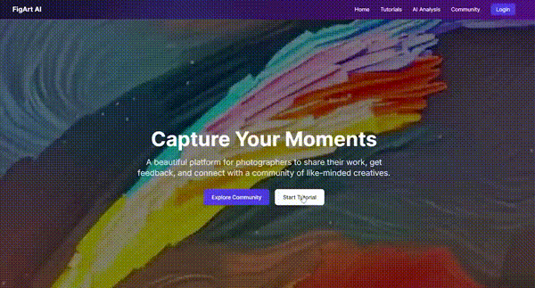

<table>
  <tr>
    <td width="70%">
      <h1>Figart AI Web Demo Version</h1>
      <p>An interactive platform designed to learn photography through AI guidance, tutorials, and community feedback. App version is under deployment - product for Moonshot 48 hackathon (March 2025, Beijing).</p>
    </td>
    <td width="30%" align="right">
      
    </td>
  </tr>
</table>

## Key Features

### Interactive Photography Tutorial
Learn to frame the perfect shot by practicing on real-world scenes. Drag a phone-shaped frame across landscape images to find the optimal composition, then compare your choices with AI recommendations and community favorites.

<!-- Tutorial Demo Video (Placeholder) -->
<div align="center">
  
  <p><i>Tutorial Demo: Practice framing the perfect shot</i></p>
</div>

### AI Photography Assistant
Our AI analyzes images to identify the most aesthetically pleasing compositions based on the following workflow:

<div align="center">
  <!-- Header Image Placeholder (Recommended size: 1200x400px) -->
  
</div>

<!-- AI Tool Demo Video (Placeholder) -->
<div align="center">
  
  <p><i>AI Tool Demo</i></p>
</div>

### Photography Community
Share your work, receive constructive feedback, and engage with fellow photographers. This community helps you grow while the AI provides personalized suggestions for improvement.

<!-- Community Demo Video (Placeholder) -->
<div align="center">
  
  <p><i>Community Demo</i></p>
</div>

## Getting Started

### Prerequisites
- Node.js 18+
- MongoDB (local or Atlas)
- API keys for AI services

### Quick Setup

1. **Clone the repository**
   ```
   git clone https://github.com/yourusername/figart-ai.git
   cd figart-ai
   ```

2. **Install dependencies**
   ```
   npm install
   ```

3. **Set up environment variables**
   Create a `.env.local` file with the necessary configuration:
   ```
   MONGODB_URI=your_mongodb_connection_string
   NEXTAUTH_URL=http://localhost:3000
   NEXTAUTH_SECRET=your_nextauth_secret
   HUGGINGFACE_API_KEY=your_huggingface_key
   OPENAI_API_KEY=your_openai_key
   ```

4. **Start the development server**
   ```
   npm run dev
   ```

5. **Open your browser**
   Navigate to [http://localhost:3000](http://localhost:3000)

6. **For community features in local environment**
   To use the community feature with others in a local environment, run the following command:
   ```
   uvicorn api_main:app
   ```

## Technology Stack

- **Frontend**: Next.js, React, TypeScript, Tailwind CSS
- **AI Services**: OpenAI API, Hugging Face Models
- **Backend**: Node.js, MongoDB
- **Authentication**: NextAuth.js

## Why Figart AI?

- **Learn by Doing**: Interactive tutorials that simulate real phone photography
- **AI-Powered Guidance**: Get instant feedback based on professional photography principles
- **Community Support**: Learn from peers and grow together in a supportive environment
- **Practical Skills**: Develop techniques you can apply immediately to your photography

## How It Works

1. **Tutorial Mode**: Practice finding the best frame in landscape photos
2. **AI Analysis**: Our algorithms evaluate compositions based on multiple factors:
   - Rule of thirds
   - Subject placement
   - Leading lines
   - Visual balance
   - Color harmony
3. **Community Interaction**: Share your frames, view popular choices, and receive feedback

## License

This project is licensed under the MIT License - see the LICENSE file for details. 